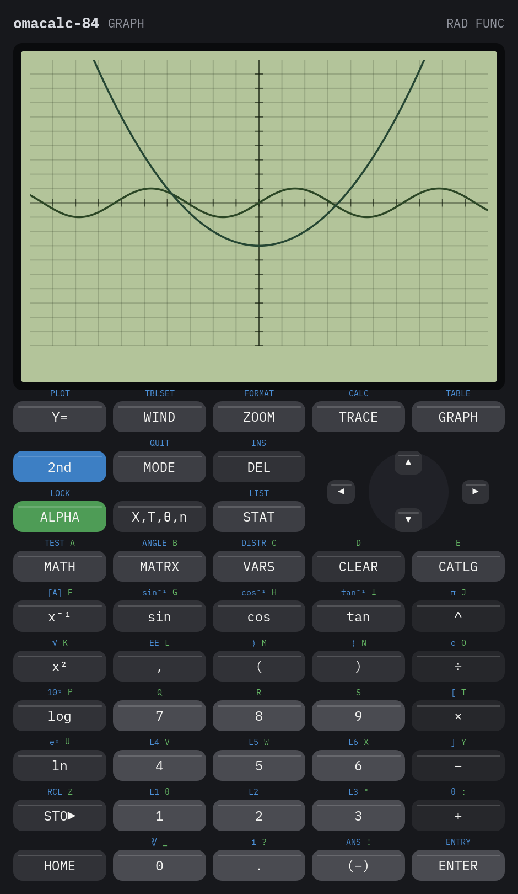
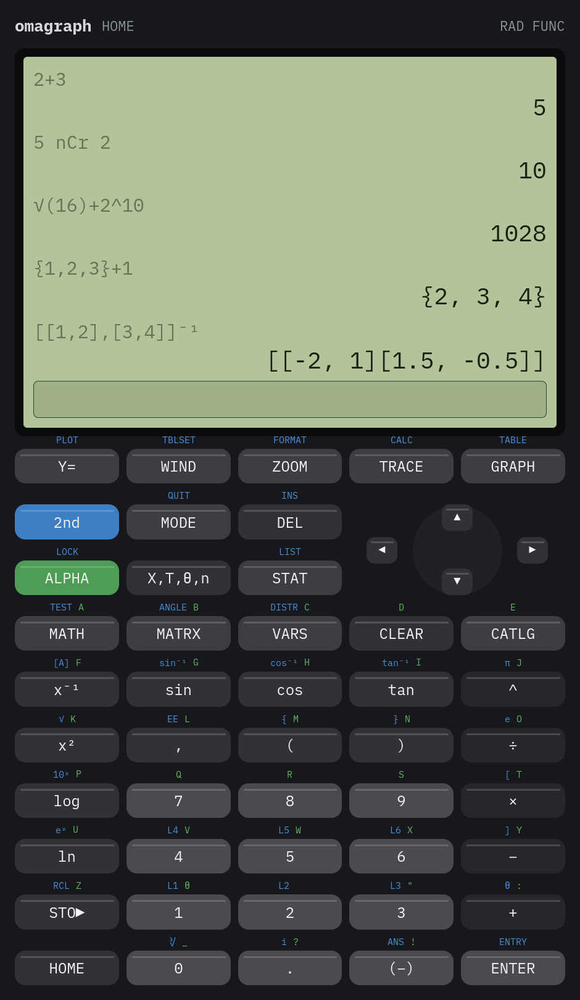
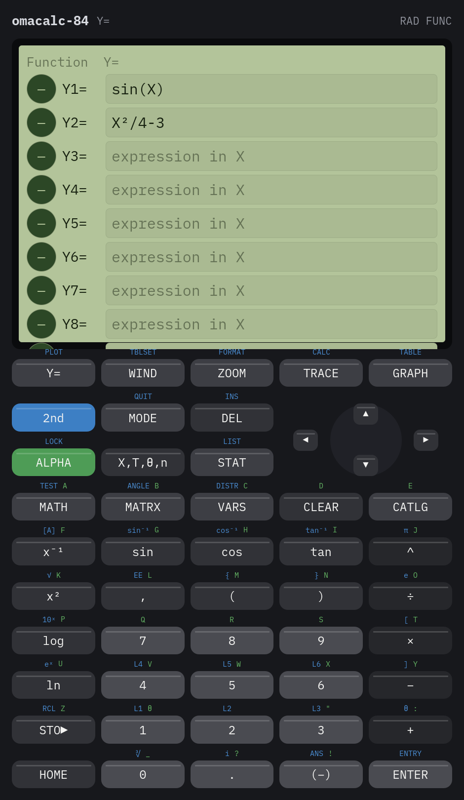
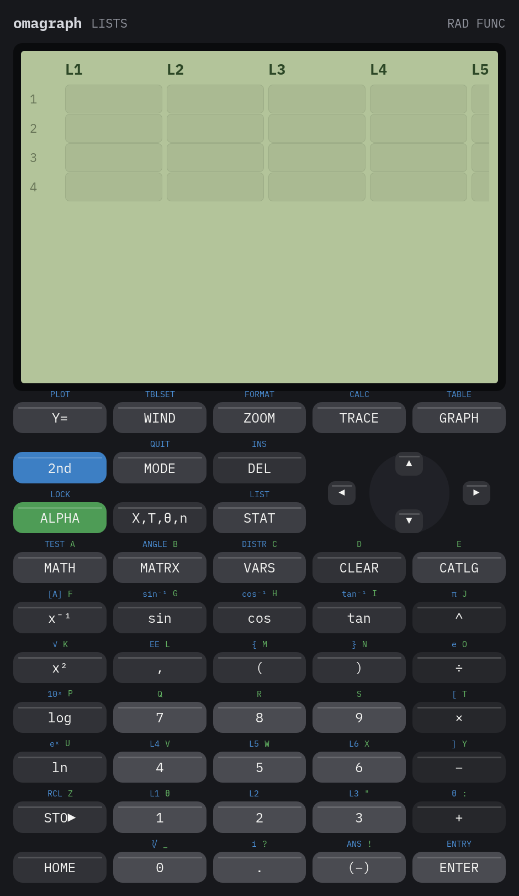
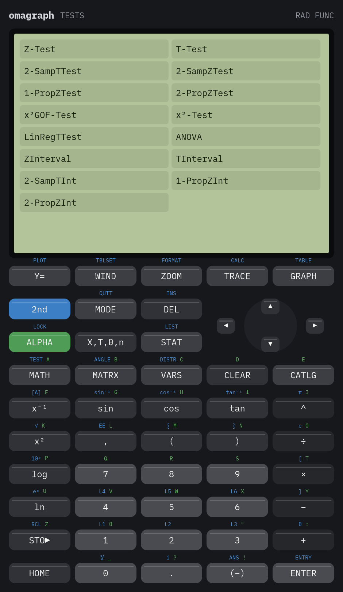
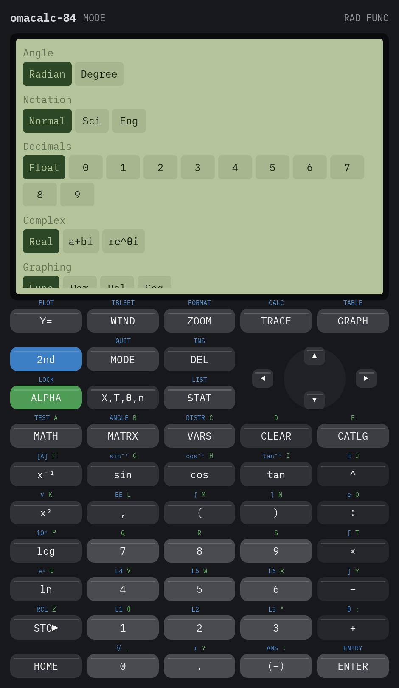

<h1 align="center">OmaCalc-84</h1>

<p align="center">
  A graphing calculator for Omarchy, with the face and the feature set of a TI-84 Plus.
</p>

<p align="center">
  
</p>

<p align="center">
  <sub>
    Functions · Parametrics · Polars · Sequences · Tables · Lists · Regressions ·
    Statistics tests · Matrices · Complex numbers
  </sub>
</p>

---

Omarchy ships **omacalc**, a lovely four-function calculator. OmaCalc-84 is that
calculator taken the rest of the way: the same theming and the same care, with
a black case, a monochrome screen, a blue `2nd` key, a green `ALPHA` key, and
everything the graphing calculator you had in school could do.

It is a real calculator, not a keypad glued to a parser. `-2²` is `-4`, powers
chain left to right so `2^3^2` is `64`, and implied multiplication ranks with
division, so `1/2X` is `(1/2)X` — the Equation Operating System rules, quirks
included. Errors come back by their proper names: `ERR:SYNTAX`,
`ERR:DIVIDE BY 0`, `ERR:NONREAL ANS`, `ERR:SINGULAR MAT`.

## What it does

OmaCalc-84 puts a full graphing calculator one click away on your Omarchy bar.
Click the calculator button to open it, or right click to go straight to the
graph. It opens in its own window, keeps your equations and lists between
sessions, and needs no network.

- **TI-84 Plus faceplate:** a black case, a monochrome LCD, and a working
  `2nd` / `ALPHA` keypad with the legends printed above each key. You can
  also switch to a flat look that follows your Omarchy theme.
- **Scientific engine:** real TI order of operations, ten significant digits,
  Sci/Eng/Fix notation, `▶Frac`, `▶DMS`, and degree or radian mode.
- **Complex numbers, lists and matrices:** first-class values that mix in any
  expression, including `a+bi` and `re^θi` forms, `L1`–`L6`, and matrix
  inverse, determinant and transpose.
- **Four graphing modes:** function, parametric, polar and sequence graphs,
  with ten equations per mode, a line style for each, and curves that break
  at asymptotes.
- **Zoom and trace:** ZStandard, ZTrig, ZDecimal, ZSquare, ZoomFit, ZInteger,
  ZoomStat and more. Scroll to zoom, tap to place the cursor, and trace along
  any curve.
- **CALC menu:** value, zero, minimum, maximum, intersect, `dy/dx` and
  `∫f(x)dx` on the graph.
- **Table of values:** tables built from `TblStart` and `ΔTbl`.
- **Calculus on the home screen:** `nDeriv`, `fnInt`, `fMin`, `fMax` and
  `solve`.
- **Statistics:** a spreadsheet-style list editor, 1-Var and 2-Var stats, and
  three stat plots (scatter, xy-line, histogram, box plot, normal probability).
- **Eleven regression models:** LinReg, QuadReg, CubicReg, QuartReg, LnReg,
  ExpReg, PwrReg, Logistic, SinReg and Med-Med, each storable into `Y1`.
- **Fifteen inference procedures:** Z/T tests, two-sample and proportion
  tests, χ² goodness-of-fit and independence, LinRegTTest, ANOVA, and their
  confidence intervals.
- **Every DISTR distribution:** normal, t, χ², F, binomial, Poisson and
  geometric pdf and cdf, plus `invNorm` and `invT`.
- **Live Omarchy theming:** colours re-tint when you switch themes, and text
  follows `omarchy display text size`.
- **Keyboard and command line:** type expressions directly, `Ctrl+C` copies the
  answer, and `omacalc-84 --eval '5!'` works in scripts.

## Install

```sh
omarchy plugin add https://github.com/OmarchyFans/omarchy-fans-omacalc-84 --enable
cd ~/.config/omarchy/plugins/fans.omarchy.omacalc-84
./install.sh
```

`omarchy plugin add` installs the bar button. `install.sh` builds the
calculator from source and then asks, one at a time, whether you want it linked
into `~/.local/bin`, given a desktop entry, bound to `SUPER + ALT + C`, and
whether Omarchy's calculator key (`SUPER + CTRL + Q`) should open it instead of
the built-in one. Say no to all four and the bar button still works: it always runs the copy
built inside the plugin folder, by absolute path, never whatever is first on
`PATH`. Before starting it, the button checks that the file and every
directory above it belong to you (or root) and are not writable by anyone
else. Nothing is
overwritten, and every config file is backed up before a line is appended.

`--enable` puts the button on the bar and asks which section it belongs in. If
you added the plugin without it, place the button any time with:

```sh
omarchy plugin enable fans.omarchy.omacalc-84 right
```

**Requirements:** `qt6-base`, `qt6-declarative`, `base-devel` (to build), and an
`xdg-desktop-portal` backend. On a stock Omarchy only `base-devel` may be
missing:

```sh
sudo pacman -S --needed qt6-base qt6-declarative base-devel
```

### Updates

About once every six hours the bar button fetches this repository's
`manifest.json` (one small HTTPS request, no personal data). If a newer version
is out, a dot appears on the button and the next click shows what changed, from
`CHANGELOG.md`. *Update…* opens a terminal that runs `omarchy plugin update`
(it shows the diff and asks), then `install.sh`, which asks before rebuilding
the calculator. If the plugin was updated but the calculator was built for an
older version (`install.sh` records which), the button offers *Finish update…*
instead. *Later* hides that version. Set
`"update_check": false` in `~/.config/omacalc-84/config.json` to turn the
check off. By hand:

```sh
omarchy plugin update fans.omarchy.omacalc-84
~/.config/omarchy/plugins/fans.omarchy.omacalc-84/install.sh
```

The update script is run the same way as the calculator: by absolute path,
after the ownership and permission checks, with a closed environment. See
[docs/update-alerts.md](docs/update-alerts.md) for how it is built.

## Remove

```sh
cd ~/.config/omarchy/plugins/fans.omarchy.omacalc-84
./uninstall.sh
omarchy plugin disable fans.omarchy.omacalc-84
omarchy plugin remove fans.omarchy.omacalc-84
```

`uninstall.sh` takes back the link, the desktop entry and both keybindings.
Your window size, equations and lists live in
`~/.config/omarchy.fans/omacalc-84.conf` and are left alone — delete that file if
you want them gone too.

## Using it

<table>
  <tr>
    <td width="50%"></td>
    <td width="50%"></td>
  </tr>
  <tr>
    <td align="center"><sub>Every answer stays on screen above the line you are typing</sub></td>
    <td align="center"><sub>Ten equations, each with its own line style</sub></td>
  </tr>
</table>

It is a line editor, not a button sequence: type the whole expression, press
`ENTER`. The keypad types into whichever field holds the cursor, so the same
pad drives the home screen, the `Y=` editor, the window variables, the list
editor and the matrix editor.

`2nd` and `ALPHA` shift the keypad the way the legends printed above each key
describe — blue for the second function, green for the letter.

### Screens

| Key | Screen |
| --- | --- |
| `Y=` | the equations for the current graphing mode |
| `WIND` | `Xmin`/`Xmax`/`Xscl`, `Ymin`/`Ymax`/`Yscl`, `Xres`, the parametric, polar and sequence ranges, and `TblStart`/`ΔTbl` |
| `ZOOM` | ZStandard, ZTrig, ZDecimal, ZSquare, Zoom In/Out, ZoomFit, ZInteger, ZoomStat, ZPrevious |
| `TRACE` | walks the cursor along a curve; `▲`/`▼` change which equation is traced |
| `GRAPH` | the plot — tap to move the cursor, scroll to zoom |
| `2nd GRAPH` | the table of values |
| `2nd TRACE` | value, zero, minimum, maximum, intersect, `dy/dx`, `∫f(x)dx` |
| `STAT` | the list editor, 1-Var/2-Var stats, the regressions, and the tests |
| `MATRX` | the matrix editor and the matrix functions |
| `MODE` | angle, notation, decimals, complex, graphing mode, plot style, grid, axes, faceplate |

### Expressions

```
2(3+4)              14
5!                  120
5 nCr 2             10
sin(30)             .5          (in Degree mode)
√(16)+2^10          1028
{1,2,3}+1           {2, 3, 4}
[[1,2],[3,4]]⁻¹     [[-2, 1][1.5, -0.5]]
0.75▶Frac           3/4
5→A: A²             25
fnInt(X²,X,0,1)     .3333333333
solve(X²-2,X,1)     1.414213562
normalcdf(-1,1)     .6826894921
```

Values are complex numbers, lists or matrices, and they mix: `mean(L1)` works
on the home screen, a regression can be stored straight into `Y1`, and `√(-4)`
is `2i` once the MODE screen is set to `a+bi`.

The whole catalogue is there — trigonometric, inverse and hyperbolic functions,
`ln`, `log`, `logBASE`, roots, `abs`, `round`, `iPart`, `fPart`, `int`, `min`,
`max`, `gcd`, `lcm`, `remainder`, `nPr`, `nCr`, `!`, the random family, the
complex parts, the list functions, the matrix functions, the calculus routines
(`nDeriv`, `fnInt`, `fMin`, `fMax`, `solve`) and every distribution in DISTR.

Answers show ten significant digits and go to scientific notation past that;
Sci, Eng and a fixed number of decimals are on the MODE screen.

### Graphing

Function, parametric, polar and sequence modes each keep their own equations
(`Y1`–`Y0`, `X1T`/`Y1T`–`X6T`/`Y6T`, `r1`–`r6`, `u`/`v`/`w`). Any equation can
be switched off or drawn thick or dotted — press and hold its dot in the `Y=`
editor to cycle the style. Curves break at an asymptote instead of joining
across the screen.

### Statistics

<table>
  <tr>
    <td width="50%"></td>
    <td width="50%"></td>
  </tr>
</table>

`L1`–`L6` are edited in a grid and are ordinary values everywhere else. The
regressions are LinReg (both forms), QuadReg, CubicReg, QuartReg, LnReg,
ExpReg, PwrReg, Logistic, SinReg and Med-Med; any of them stores into `Y1` and
draws over a scatter plot. Three stat plots cover scatter, xy-line, histogram,
box plot and normal probability.

The tests are Z-Test, T-Test, 2-SampTTest, 2-SampZTest, 1-PropZTest,
2-PropZTest, χ²GOF-Test, χ²-Test, LinRegTTest, ANOVA, ZInterval, TInterval,
2-SampTInt, 1-PropZInt and 2-PropZInt.

### The faceplate

<p align="center">
  
</p>

The calculator is drawn as the hardware it imitates. If you would rather it
disappeared into the desktop, `MODE` → **Faceplate** → *Desktop theme* gives it
the flat look that follows your Omarchy colours, which is what omacalc looks
like today.

Either way the theme is live: colours come from
`~/.local/state/omarchy/current/theme/colors.toml` and re-tint when you switch
themes, and text follows `omarchy display text size`.

### Keyboard and command line

Typing goes to the focused field, so you can write an expression out directly.
`Enter` evaluates, `Escape` goes home, `Ctrl+C` copies the last answer,
`Ctrl+Q` quits.

```sh
omacalc-84 --eval '5!' --eval 'fnInt(X²,X,0,1)'   # 120, .3333333333
omacalc-84 --screen graph                          # open straight onto a screen
omacalc-84 --screenshot shot.png                   # render the interface and exit
```

## What is not here

- Sequence mode graphs explicit formulas in `n`; recursive definitions that
  refer to `u(n-1)` are not supported.
- No programming (`PRGM`), no `APPS`, and no link or transfer menu.
- No `DRAW` menu, so nothing is drawn on a graph by hand.
- Degrees-minutes-seconds display with `▶DMS`, but `30°15'` cannot be typed in.
- `ENTER` in the `Y=`, list and matrix editors commits the field without moving
  to the next one.

## Built on

OmaCalc-84 is a fork of [omacom-io/omacalc](https://github.com/omacom-io/omacalc),
the calculator that ships with Omarchy, and keeps its theming, its text scaling
and its window behaviour. The expression engine, the graphing, the statistics
and the case are new. The copyright and MIT licence of the original are
retained in [LICENSE](LICENSE).

The keypad is set in iA Writer Mono, bundled under the SIL Open Font License
1.1 (see [fonts/OFL.txt](fonts/OFL.txt)); the font is copyright Information
Architects Inc. and is based on IBM Plex, copyright IBM Corp.

There are no other dependencies beyond Qt 6 and a desktop portal.

## Tests

```sh
./bin/test
```

41 cases covering the expression engine (precedence, every function family,
formatting, the error names), the graphing backend (sampling in all four modes,
zoom, table, trace, the CALC routines) and the statistics (summaries, every
regression model, and the inference procedures checked against known values).

## License

MIT. See [LICENSE](LICENSE).
