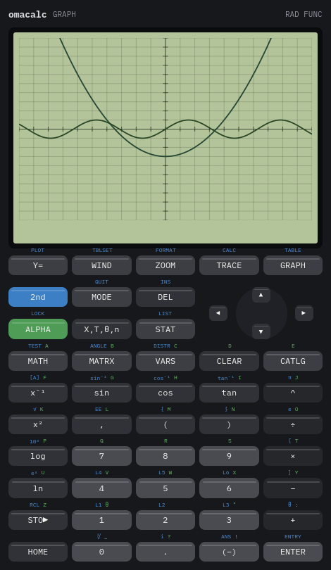

# Omacalc

A graphing calculator built with Qt Quick and C++, with the face and the
feature set of a TI-84 Plus.

This is a fork of [omacom-io/omacalc](https://github.com/omacom-io/omacalc),
which is a dead-simple four-function calculator. It keeps that
calculator's theming and window behaviour, and adds the face, the keypad and
the scientific and graphing capabilities of a TI-84 Plus.



## Install

```sh
./bin/build          # needs a Qt 6 qmake (qmake6)
./build/omacalc
```

The upstream `omacalc` package owns `/usr/bin/omacalc`, so this build stays in
`build/`. To have the desktop's calculator key open this one instead, put it
somewhere that comes earlier on `PATH` than `/usr/bin`:

```sh
sudo cp build/omacalc /usr/local/bin/omacalc
```

`~/.local/bin` will not do it on a stock Omarchy, because that directory is
searched *after* `/usr/bin`. The alternative is to point the key binding at the
build directly. Removing `/usr/local/bin/omacalc` gives the packaged calculator
back — nothing is overwritten.

## Using it

The calculator is a line editor, not a button sequence: you type a whole
expression and press `ENTER`. The keypad types into whichever field has the
cursor, so the same pad drives the home screen, the `Y=` editor, the window
variables, the list editor and the matrix editor.

`2nd` and `ALPHA` shift the keypad the way the printed legends above each key
describe. `2nd` reaches the second function (`√`, `π`, `sin⁻¹`, `L1`, `ANS`,
`ENTRY`, …); `ALPHA` types the letter in the corner, and `2nd ALPHA` locks it.

### Screens

| Key | Screen |
| --- | --- |
| `Y=` | the equation editor for the current graphing mode |
| `WIND` | `Xmin`/`Xmax`/`Xscl`, `Ymin`/`Ymax`/`Yscl`, `Xres`, the parametric, polar and sequence ranges, and `TblStart`/`ΔTbl` |
| `ZOOM` | ZStandard, ZTrig, ZDecimal, ZSquare, Zoom In/Out, ZoomFit, ZInteger, ZoomStat, ZPrevious |
| `TRACE` | walks the cursor along a curve; `▲`/`▼` change which equation is traced |
| `GRAPH` | the plot; tap to move the trace cursor, scroll to zoom |
| `2nd GRAPH` | the table of values |
| `2nd TRACE` | the CALC menu: value, zero, minimum, maximum, intersect, `dy/dx`, `∫f(x)dx` |
| `STAT` | the list editor, 1-Var/2-Var stats, every regression model, and STAT TESTS |
| `MATRX` | the matrix editor and matrix functions |
| `MODE` | angle, notation, decimals, complex, graphing mode, plot style, grid, axes |

### The face

The calculator is drawn as the hardware it imitates: a moulded case, a
monochrome screen, a blue `2nd` key and a green `ALPHA` key, and each key's
second and alpha functions printed above it in the matching colour. `MODE` has
a **Faceplate** setting that swaps this for a flat one following the Omarchy
theme, which is what upstream looks like.

### Command line

`--screen graph` (or `home`, `table`, `lists`, `stats`, `matrix`, `mode`,
`tests`, …) opens straight onto one screen. `--screenshot FILE` writes the
interface to a PNG and exits. `--eval EXPR` enters an expression as if it had
been typed, printing the answer and leaving it on the home screen:

```sh
omacalc --eval '5!' --eval 'fnInt(X²,X,0,1)'
120
.3333333333
```

### Expressions

Precedence follows the calculator's Equation Operating System, including the
parts that surprise people: `-2²` is `-4`, powers chain left to right so
`2^3^2` is `64`, and implied multiplication ranks with division, so `1/2X` is
`(1/2)X`. A closing parenthesis may be left off at the end of a line.

Values are complex numbers, lists or matrices:

```
2(3+4)              14
5!                  120
5 nCr 2             10
√(16)               4
sin(30)             .5          (in Degree mode)
{1,2,3}+1           {2, 3, 4}
[[1,2],[3,4]]⁻¹     [[-2, 1][1.5, -0.5]]
0.75▶Frac           3/4
5→A: A²             25
fnInt(X²,X,0,1)     .3333333333
solve(X²-2,X,1)     1.414213562
```

Available throughout: the trigonometric, inverse and hyperbolic functions,
`ln`, `log`, `logBASE`, `e^`, `10^`, roots, `abs`, `round`, `iPart`, `fPart`,
`int`, `min`, `max`, `gcd`, `lcm`, `remainder`, `nPr`, `nCr`, `!`, the random
family, the complex parts (`conj`, `real`, `imag`, `angle`), the list functions
(`sum`, `prod`, `mean`, `median`, `stdDev`, `variance`, `cumSum`, `ΔList`,
`sortA`, `sortD`, `seq`, `augment`, `dim`, `fill`), the matrix functions
(`det`, `ᵀ`, `identity`, `ref`, `rref`, `augment`, `randM`), the calculus
routines (`nDeriv`, `fnInt`, `fMin`, `fMax`, `solve`) and the whole DISTR menu
(`normalpdf`/`cdf`, `invNorm`, `t`, `χ²`, `F`, `binom`, `poisson`, `geomet`).
Errors are reported by the same names the calculator uses: `ERR:SYNTAX`,
`ERR:DIVIDE BY 0`, `ERR:DOMAIN`, `ERR:NONREAL ANS`, `ERR:DIM MISMATCH`,
`ERR:SINGULAR MAT`.

Answers show ten significant digits, switching to scientific notation past
that, and the MODE screen offers Sci and Eng notation and a fixed number of
decimals.

### Graphing

Function, parametric, polar and sequence modes each get their own set of
equations (`Y1`–`Y0`, `X1T`/`Y1T`–`X6T`/`Y6T`, `r1`–`r6`, `u`/`v`/`w`). Each
equation can be switched off or given a thick or dotted line; press and hold
its dot in the `Y=` editor to cycle the style. Curves break rather than
joining across an asymptote.

### Statistics

`L1`–`L6` are edited in a grid and are ordinary values everywhere else, so
`mean(L1)` works on the home screen. The regression models are LinReg (both
forms), QuadReg, CubicReg, QuartReg, LnReg, ExpReg, PwrReg, Logistic, SinReg
and Med-Med; any of them can be stored into `Y1` and drawn over a scatter plot.
Three stat plots support scatter, xy-line, histogram, box plot and normal
probability.

STAT TESTS covers Z-Test, T-Test, 2-SampTTest, 2-SampZTest, 1-PropZTest,
2-PropZTest, χ²GOF-Test, χ²-Test, LinRegTTest, ANOVA, ZInterval, TInterval,
2-SampTInt, 1-PropZInt and 2-PropZInt.

### Keyboard

Typing goes to the focused field, so an expression can be written out directly.
`Enter` evaluates, `Escape` returns to the home screen, `Ctrl+C` copies the
last answer and `Ctrl+Q` quits.

## What is not here

- Sequence mode graphs explicit formulas in `n`; recursive definitions that
  refer to `u(n-1)` are not supported.
- There is no programming (`PRGM`), no `APPS`, and no link or transfer menu.
- There is no `DRAW` menu, so no drawing on top of a graph by hand.
- Degrees-minutes-seconds can be displayed with `▶DMS` but not typed in, so
  `30°15'` is a syntax error.
- `ENTER` in the `Y=`, list and matrix editors commits the field but does not
  move the cursor to the next one.
- The settings live in the same `Omacom/omacalc.conf` as the packaged
  `omacalc`, so the two share their window size and position.

## Requirements

- Qt 6: `qt6-base`, `qt6-declarative`
- `xdg-desktop-portal` and a portal backend

With the faceplate set to the desktop theme, colors follow the current Omarchy
theme
(`~/.local/state/omarchy/current/theme/colors.toml`) and re-tint live when the
theme changes. Text follows the desktop text size — `omarchy display text
size`, or GNOME's `text-scaling-factor`.

The iA Writer Mono font is bundled under the SIL Open Font License 1.1; see
`fonts/OFL.txt`. The font is copyright Information Architects Inc. and based on
IBM Plex, copyright IBM Corp.

## Tests

```sh
./bin/test
```

The suite covers the expression engine (precedence, every function family,
formatting, the error names), the graphing backend (sampling in all four
modes, zoom, table, trace, the CALC routines), and the statistics (summaries,
every regression model, and the inference procedures against known values).
